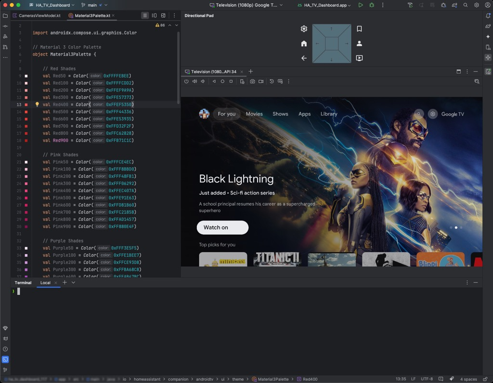

# dpad-ui-addon
Directional Pad (DPad) UI addon for Android Studio

### Build Using IntelliJ IDEA:

- `Gradle`->`Tasks`->`build` 
- and will generate `D-Pad-UI-Addon-<version>.jar` 
- will be in `build/libs` 

### How to use:

- Open Android Studio
- Open `Settings…`->`Plugins`->The ⚙️-> `Install plugin from Disk…`
- Navigate to `<project-location>/build/libs/D-Pad-UI-Addon-<version>.jar`

### Wish list:

- [x] initial proof of concept
- [ ] work on layout and maybe use graphics?
- [ ] create a better icon

### Features: 

Add your ideas to the [issues](https://github.com/nodinosaur/dpad-ui-addon/issues).