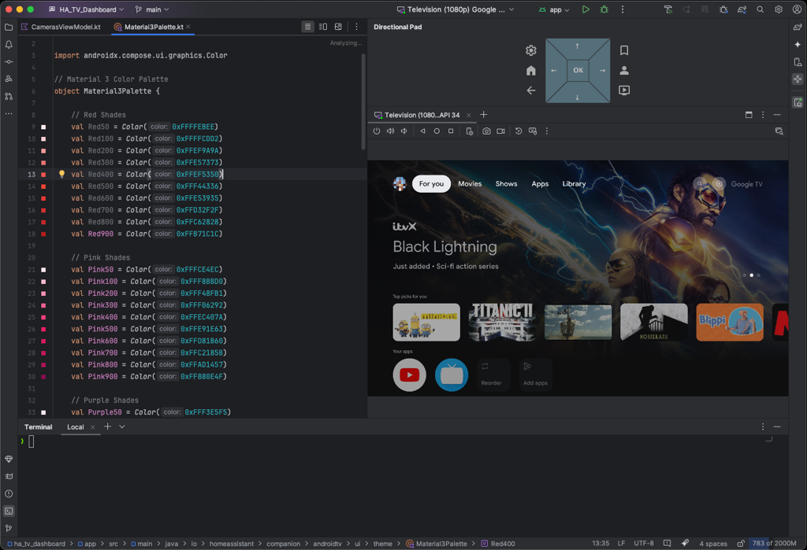
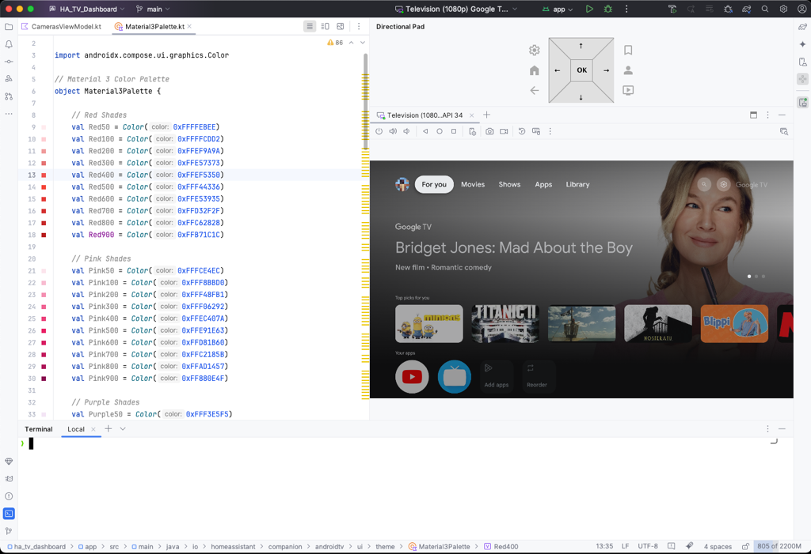

# dpad-ui-addon
Directional Pad (DPad) UI addon for Android Studio

**[Download on the Store](https://plugins.jetbrains.com/plugin/27026-d-pad-ui-addon/)**

### Build Using IntelliJ IDEA:

- `Gradle`->`Tasks`->`build` 
- and will generate `D-Pad-UI-Addon-<version>.jar` 
- will be in `build/libs` 

### How to use:

- Open Android Studio
- Open `Settings…`->`Plugins`->The ⚙️-> `Install plugin from Disk…`
- Navigate to `<project-location>/build/libs/D-Pad-UI-Addon-<version>.jar`

### Wish list:

- [x] initial proof of concept
- [ ] work on layout and maybe use graphics?
- [x] create a better icon
- [x] Dpad keycode mapping from [Keyboard devices](https://source.android.com/devices/input/keyboard-devices)

### References:
- `idea/streaming/screen-sharing-agent/app/src/main/cpp/virtual_input_device.cc`
- `idea/streaming/screen-sharing-agent/app/src/main/cpp/virtual_input_device.cc`
- `idea/streaming/src/com/android/tools/idea/streaming/device/AndroidKeyCodes.kt`
- `idea/streaming/src/com/android/tools/idea/streaming/device/DeviceView.kt`
- `qemu/distrib.sdl2-2.0.3/src/joysick/android/SDL_sysjoystick.c`
- `qemu/distrib.sdl2-2.0.3/src/video/android/SDL_androidkeyboard.c`

### Features: 

Add your ideas to the [issues](https://github.com/nodinosaur/dpad-ui-addon/issues).